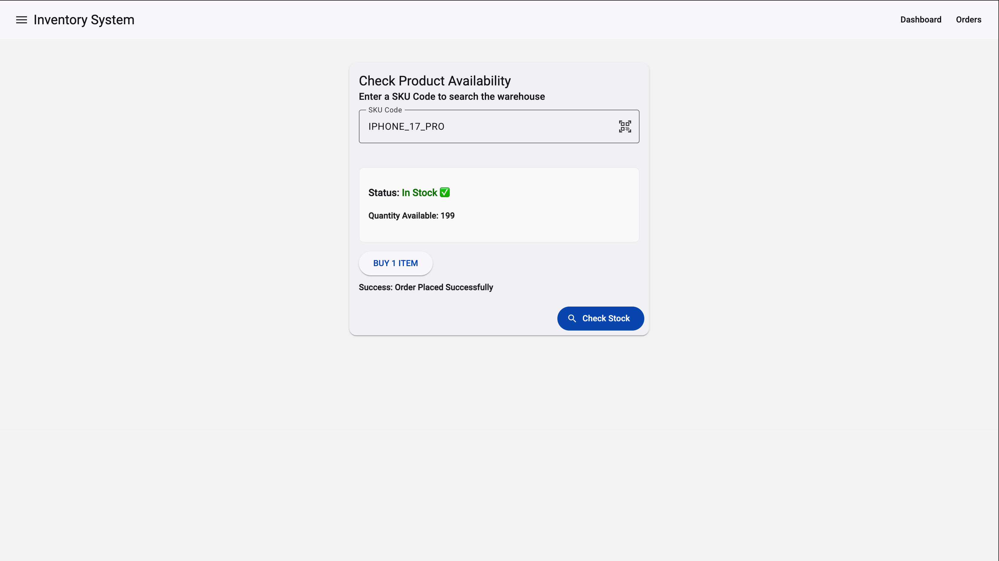
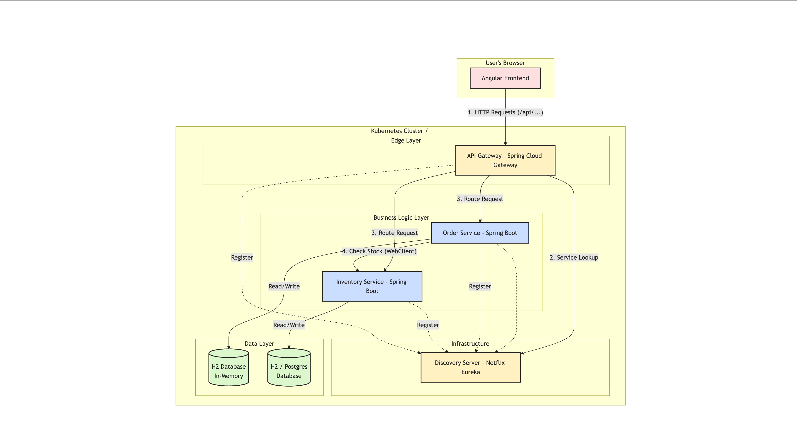

# Inventory System

This project is a microservices-based inventory management system consisting of a Java Spring Boot backend and an Angular frontend.



## Architecture



The system is built using a microservices architecture:

- **Frontend**: Angular application acting as the user interface.
- **API Gateway**: Entry point for all client requests (Port 9090).
- **Discovery Server**: Eureka server for service registration and discovery (Port 8761).
- **Inventory Service**: Manages product stock and availability (Port 8082).
- **Order Service**: Handles order placement (Port 8081).

## Tech Stack

- **Frontend**: Angular, Angular Material, TypeScript
- **Backend**: Java, Spring Boot, Spring Cloud (Gateway, Eureka)
- **Containerization**: Docker, Docker Compose

## Prerequisites

- Java 17+
- Node.js 18+ & npm
- Docker & Docker Compose

## Getting Started

### 1. Start the Backend Services

The backend services are containerized. You can start all of them using Docker Compose.

```bash
docker-compose up -d
```

This will start:
- Discovery Server (http://localhost:8761)
- Inventory Service
- Order Service
- API Gateway (http://localhost:9090)

### 2. Start the Frontend Application

Navigate to the frontend directory:

```bash
cd frontend
```

Install dependencies:

```bash
npm install
```

Start the development server:

```bash
npm start
```

The application will be available at `http://localhost:4200`.

## API Endpoints

The API Gateway forwards requests to the respective services:

- **Inventory**: `/api/inventory` -> Inventory Service
- **Orders**: `/api/order` -> Order Service

## Usage

1. Open the app at `http://localhost:4200`.
2. Enter a SKU Code (e.g., `IPHONE_17_PRO`) in the search box.
3. Click "Check Stock" to see availability.
4. If in stock, you can proceed to "Buy 1 Item".
